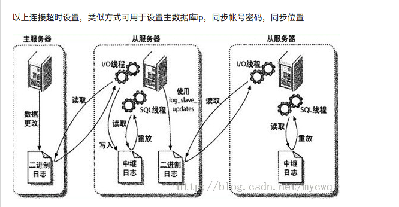
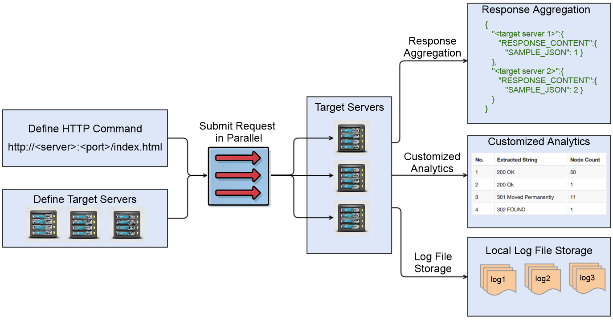
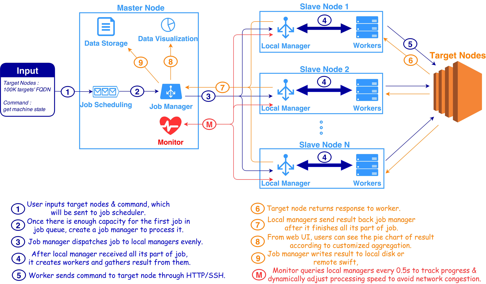

# High-load solution

##Netty
http://netty.io/

Netty is a NIO client server framework which enables quick and easy development of network applications such as protocol servers and clients. It greatly simplifies and streamlines network programming such as TCP and UDP socket server.

'Quick and easy' doesn't mean that a resulting application will suffer from a maintainability or a performance issue. Netty has been designed carefully with the experiences earned from the implementation of a lot of protocols such as FTP, SMTP, HTTP, and various binary and text-based legacy protocols. As a result, Netty has succeeded to find a way to achieve ease of development, performance, stability, and flexibility without a compromise.

 
##Nginx
tomcat结合nginx使用小结
http://cxshun.iteye.com/blog/1535188

http://tengine.taobao.org/book/#
 

##RestExpress

官网地址：https://github.com/RestExpress/RestExpress
原文的定义是这么说的：
RestExpress is the easiest way to create RESTful web services in Java. An extremely Lightweight, Fast, REST Engine and API for Java. Supports JSON and XML serialization automagically as well as ISO 8601 date formats. A thin wrapper on Netty IO HTTP handling, RestExpress lets you create performant, stand-alone REST web services rapidly.

##DB solution:

##Redis

Redis is an open source (BSD licensed), in-memory data structure store, used as database, cache and message broker. It supports data structures such as strings, hashes, lists, sets, sorted sets with range queries, bitmaps, hyperloglogs and geospatial indexes with radius queries. Redis has built-in replication, Lua scripting, LRU eviction, transactions and different levels of on-disk persistence, and provides high availability via Redis Sentinel and automatic partitioning with Redis Cluster.

##主从数据库 --Mysql
MYSQL主从同步是目前使用比较广泛的数据库架构，技术比较成熟，配置也不复杂，特别是对于负载比较大的网站，主从同步能够有效缓解数据库读写的压力。
http://blog.csdn.net/mycwq/article/details/17136001

##Amazon Aurora

问：“MySQL 的五倍性能”是什么意思？

Amazon Aurora 通过将数据库引擎与为数据库工作负载构建的基于 SSD 的虚拟化存储层紧密集成，使性能大幅超过 MySQL，从而减少至存储系统的写入操作，最大程度降低锁竞争并消除数据库进程线程所产生的延迟。我们根据 SysBench 对 r3.8xlarge 实例进行的测试表明，Amazon Aurora 每秒提供超过 500,000 次选择和 100,000 次更新，是在同一硬件上运行相同基准的 MySQL 的 5 倍。有关此基准的详细说明以及如何自行复制此基准，请参阅 Amazon Aurora 性能基准指南。
问：如何优化 Amazon Aurora 的数据库工作负载？
由于 Amazon Aurora 与 MySQL 5.6 兼容，因此现有 MySQL 应用程序和工具无需修改即可运行。然而，Amazon Aurora 优于 MySQL 的一个地方就是具有大量并行工作负载。为了在 Amazon Aurora 上最大限度地提高您的工作负载吞吐量，我们建议您构建自己的应用程序来支持大量并行查询。

##Web Server Management-->REST Commander

http://www.restcommander.com/index.html

https://raw.githubusercontent.com/eBay/restcommander/master/README.md

Monitor and Manage 10 - 100,000 Web Servers.

What is REST Commander? It is a parallel async http client, like Postman at scale.

It is a scalable, high performance yet agile tool (HTTP client as a service) for managing, configing, and rescuing large amount of web servers.

And many more use cases... Whenever comes to sending multiple HTTP requests in parallel, federated data aggregation or scalable task executions on HTTP, Think Commander First.

##In-memory solution:

Caching System.
#####TreeMap

http://www.javamadesoeasy.com/2015/04/treemap-vs-concurrentskiplistmap.html

http://www.java2novice.com/java-collections-and-util/treemap/comparator-user-object/